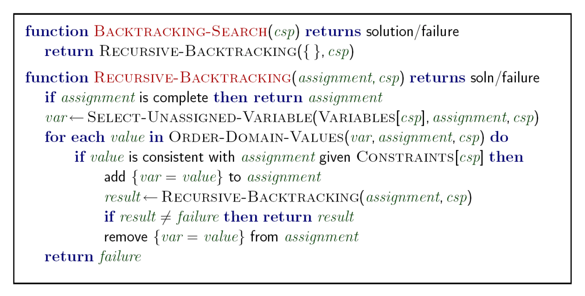

I guess what I stumbled upon with `alternate-solution-dfs.py` is backtracking search.

[Wikipedia](https://en.wikipedia.org/w/index.php?title=Backtracking&oldid=1029724906)

> The classic textbook example of the use of backtracking is the eight queens puzzle, that asks for all arrangements of eight chess queens on a standard chessboard so that no queen attacks any other. In the common backtracking approach, the partial candidates are arrangements of k queens in the first k rows of the board, all in different rows and columns. Any partial solution that contains two mutually attacking queens can be abandoned.
>
> Backtracking can be applied only for **problems which admit the concept of a "partial candidate solution"** and a relatively quick test of whether it can possibly be completed to a valid solution. It is useless, for example, for locating a given value in an unordered table. **When it is applicable, however, backtracking is often much faster than brute-force enumeration of all complete candidates, since it can eliminate many candidates with a single test.**

(I think the "relatively quick test ... possibly be completed" part corresponds to the "no child node" case in my use case here, or the mutually-attacking queens thing in the eight queens puzzle.)

[Pseudocode from CS188](https://inst.eecs.berkeley.edu/~cs188/fa18/assets/slides/lec5/FA18_cs188_lecture5_CSPs_II_4pp.pdf)
(Not my year, but same instructor)

- Wikipedia has similar pseudocode.
- My backtracking doesn't mutate `assignment`. In my use case, it was pretty simple to use immutable tuples and extend those tuples at each decision step, but probably in many use cases it would make more sense to mutate, I guess?

